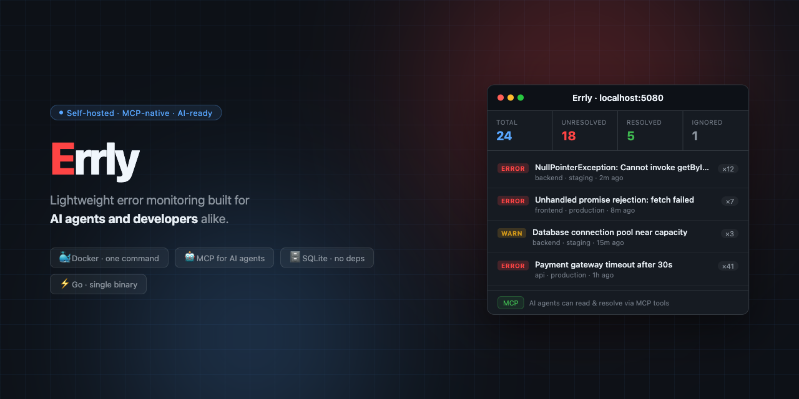

# Errly — Lightweight Self-Hosted Error Monitoring



**Built for the AI agent era.** Errly is a self-hosted error monitoring system designed from the ground up to work seamlessly with AI agents — not just humans. Your AI agent can read errors, trace stack traces, search issues, and resolve them autonomously via MCP, while your team watches everything from a clean web dashboard.

> Drop-in for small teams and solo developers who want observability without the SaaS price tag, and AI agents that can actually act on what they see.

[](https://buymeacoffee.com/auttaporn.f)

## Why Errly?

Most error monitoring tools are built for humans clicking dashboards. Errly is different:

- **MCP-native** — AI agents (Claude, Cursor, etc.) can list, search, read, and resolve issues directly via the Model Context Protocol
- **Skill files included** — drop `skill/` into your agent's context and it instantly knows how to install, integrate, and operate Errly
- **Claude Code slash commands** — `/install-errly`, `/implement-sdk`, `/use-mcp` let your AI assistant guide you step by step
- **Simple REST API** — structured JSON responses that are easy for agents and humans to parse
- **Self-hosted** — your error data stays on your infrastructure, not a third-party SaaS
- **Lightweight** — single Go binary, SQLite storage, no dependencies to manage

---

## Install with AI Agent — One Step

Got Claude Code, Cursor, or any AI agent? Just say:

> Read **https://github.com/AsYourWish-ai/Errly/blob/main/agent_install.md** and do it.

The agent will check prerequisites, start the server, run integration tests, verify all API endpoints, and report back when Errly is ready.

---

## Table of Contents

1. [Quick Start](#1-quick-start)
2. [Dashboard](#2-dashboard)
3. [Install the SDK](#3-install-the-sdk)
   - [Go](#go-sdk)
   - [Python](#python-sdk)
   - [TypeScript / Next.js](#typescript--nextjs-sdk)
4. [MCP (AI Agents)](#4-mcp-for-ai-agents)
5. [SDK Usage](#5-sdk-usage)
6. [REST API](#6-rest-api)
7. [Configuration](#7-configuration)
8. [Project Structure](#8-project-structure)
9. [Agent Skills](#9-agent-skills)

---

## 1. Quick Start

```bash
ERRLY_API_KEY=your-secret-key docker compose up -d
```

Server starts at **http://localhost:5080**

### Development (auto-rebuild on file change)

```bash
ERRLY_API_KEY=your-secret-key docker compose watch
```

### Build from source

```bash
cd src/server
go build -o errly-server .
ERRLY_API_KEY=your-secret-key ./errly-server
```

---

## 2. Dashboard

Open **http://localhost:5080** in your browser.

Features:
- Stats bar — total / unresolved / resolved / ignored / events
- Issue list with level badge, project, environment, count, last seen
- Detail panel — stack trace, recent events, tags, metadata
- Filter by project, environment, status
- Search issues
- Resolve / ignore / reopen actions
- Auto-refresh every 30 seconds
- API key stored in `localStorage`

---

## 3. Install the SDK

### Go SDK

```bash
go get github.com/AsYourWish-ai/Errly/sdk/go
```

```go
import errly "github.com/AsYourWish-ai/Errly/sdk/go"

client := errly.New(
    "http://localhost:5080",
    "your-secret-key",
    errly.WithProject("my-api"),
    errly.WithEnvironment("production"),
    errly.WithRelease("v1.0.0"),
)
defer client.Flush()
```

**Local / monorepo install:**

```
# go.mod
replace github.com/AsYourWish-ai/Errly/sdk/go => ./sdk/go
```

---

### Python SDK

```bash
pip install errly

# With framework integrations
pip install "errly[fastapi]"
pip install "errly[flask]"
```

```python
from errly import Errly

errly = Errly(
    url="http://localhost:5080",
    api_key="your-secret-key",
    project="my-service",
    environment="production",
    release="v1.0.0",
)
```

**Local install:**

```bash
pip install -e ./sdk/python
```

---

### TypeScript / Next.js SDK

```bash
npm install @errly/sdk
```

```typescript
// lib/errly.ts
import { Errly } from '@errly/sdk'

export const errly = new Errly({
  url: process.env.NEXT_PUBLIC_ERRLY_URL!,   // http://localhost:5080
  apiKey: process.env.ERRLY_API_KEY,
  project: 'my-web-app',
  environment: process.env.NODE_ENV,
  release: process.env.NEXT_PUBLIC_RELEASE,
})
```

**Local install:**

```json
{ "dependencies": { "@errly/sdk": "file:./sdk/ts" } }
```

---

## 4. MCP (for AI Agents)

Build the MCP image once:

```bash
docker build -f Dockerfile.mcp -t errly-mcp .
```

Add to your MCP config (`.mcp.json` or Claude Desktop settings):

```json
{
  "mcpServers": {
    "errly": {
      "command": "docker",
      "args": [
        "run", "--rm", "-i", "--network", "host",
        "-e", "ERRLY_URL=http://localhost:5080",
        "-e", "ERRLY_API_KEY=your-secret-key",
        "errly-mcp"
      ]
    }
  }
}
```

**Available MCP tools:**

| Tool | Description |
|------|-------------|
| `list_issues` | List issues filtered by status / project / env |
| `get_issue` | Get full issue details + last event |
| `get_issue_events` | Get recent occurrences with stack traces |
| `search_issues` | Search issues by keyword |
| `resolve_issue` | Resolve, ignore, or reopen an issue |
| `get_stats` | Total issues, events in last 24h |

**Example prompts:**
- _"Show me all unresolved errors in production"_
- _"Find errors related to payment"_
- _"Resolve issue abc123"_
- _"How many errors happened in the last 24 hours?"_

---

## 5. SDK Usage

### Go

```go
// Capture an error
if err := doSomething(); err != nil {
    client.CaptureError(ctx, err)
}

// Capture a message
client.CaptureMessage(ctx, "warning", "Payment service degraded")

// Set user context
client.SetUser(&errly.UserInfo{ID: "123", Email: "user@example.com"})

// Add a breadcrumb
client.AddBreadcrumb("database", "query executed", "info")

// HTTP middleware — auto-captures panics
http.ListenAndServe(":5080", client.Middleware(myHandler))
```

### Python

```python
# Capture an exception
try:
    risky_operation()
except Exception as e:
    errly.capture_exception(e)

# Capture a message
errly.capture_message("Payment service slow", level="warning")

# Set user context
errly.set_user(user_id="123", email="user@example.com")

# Add a breadcrumb
errly.add_breadcrumb("API call to payment", category="http")

# FastAPI integration
app = errly.instrument_fastapi(app)

# Flask integration
app = errly.instrument_flask(app)

# Flush before shutdown
errly.flush(timeout=5)
```

### TypeScript / Next.js

```typescript
// Capture an error
errly.captureError(new Error('Something broke'))

// Capture a message
errly.captureMessage('Checkout slow', 'warning')

// Set user context
errly.setUser({ id: '123', email: 'user@example.com' })

// Add a breadcrumb
errly.addBreadcrumb('button clicked', 'ui')

// app/global-error.tsx
'use client'
export default function GlobalError({ error }: { error: Error }) {
  errly.captureError(error)
  return <div>Something went wrong</div>
}

// Pages Router — API route wrapper
export default errly.withNextJS(async function handler(req, res) {
  res.json({ ok: true })
})

// App Router — Server Action wrapper
const createUser = errly.withAction(async (data: FormData) => {
  // errors auto-captured
})

// React Error Boundary
import { createErrorBoundaryHandler } from '@errly/sdk'
<ErrorBoundary {...createErrorBoundaryHandler(errly)}>
  <App />
</ErrorBoundary>
```

---

## 6. REST API

All endpoints except `POST /api/v1/events` require the `X-Errly-Key` header.

```
GET  /                           — Web dashboard UI
POST /api/v1/events              — Ingest event (SDK)
GET  /api/v1/issues              — List issues (?status=&project=&env=&limit=&offset=)
GET  /api/v1/issues/:id          — Get issue
GET  /api/v1/issues/:id/events   — Get issue events
GET  /api/v1/issues/search?q=    — Search issues
PUT  /api/v1/issues/:id/status   — Update status {"status":"resolved"}
GET  /api/v1/stats               — Statistics (?project=)
GET  /api/v1/projects            — List distinct project keys
GET  /api/v1/environments        — List distinct environment values
GET  /healthz                    — Health check
```

---

## 7. Configuration

| Env Var | Default | Description |
|---------|---------|-------------|
| `ERRLY_ADDR` | `:5080` | Server listen address |
| `ERRLY_DB_PATH` | `./errly.db` | SQLite database path |
| `ERRLY_API_KEY` | _(none)_ | API key — **set this!** |
| `ERRLY_RATE_LIMIT` | `100` | Max ingest requests/min per IP |
| `ERRLY_AUTO_REMOVE_RESOLVED` | `false` | Delete issues automatically when resolved |
| `ERRLY_URL` | `http://localhost:5080` | MCP → server URL |

---

## 8. Project Structure

```
Errly/
├── src/
│   ├── server/          Go HTTP server + dashboard UI (SQLite)
│   └── mcp/             MCP server for AI agents (Go)
├── sdk/
│   ├── go/              Go SDK
│   ├── python/          Python SDK
│   └── ts/              TypeScript / Next.js SDK
├── skill/               Agent skill definitions (see below)
├── Dockerfile.server
├── Dockerfile.mcp
├── docker-compose.yml
└── .mcp.json            MCP config (Claude Code / Claude Desktop)
```

---

## 9. Agent Skills

The `skill/` folder contains instruction files for AI agents (Claude Code, Claude Desktop, Cursor, etc.). Each file describes how an agent should help a user with a specific task.

| Skill file | Purpose |
|------------|---------|
| [`skill/install-errly.md`](skill/install-errly.md) | Guide an agent to install, start, and verify the Errly server |
| [`skill/implement-sdk.md`](skill/implement-sdk.md) | Guide an agent to detect the project stack and integrate the SDK |
| [`skill/use-mcp.md`](skill/use-mcp.md) | Guide an agent to set up MCP and use Errly tools in AI chat |

### Claude Code — slash commands

This repo also ships pre-built slash commands in `.claude/commands/`. Open the project in Claude Code and run:

```
/install-errly     — set up the Errly server
/implement-sdk     — integrate the SDK into your project
/use-mcp           — connect an AI agent via MCP
```

---

## Support

Building and maintaining this project — including all the AI-assisted development — costs real tokens. If Errly saves you time, a coffee would help keep the tokens flowing!

[](https://buymeacoffee.com/auttaporn.f)
